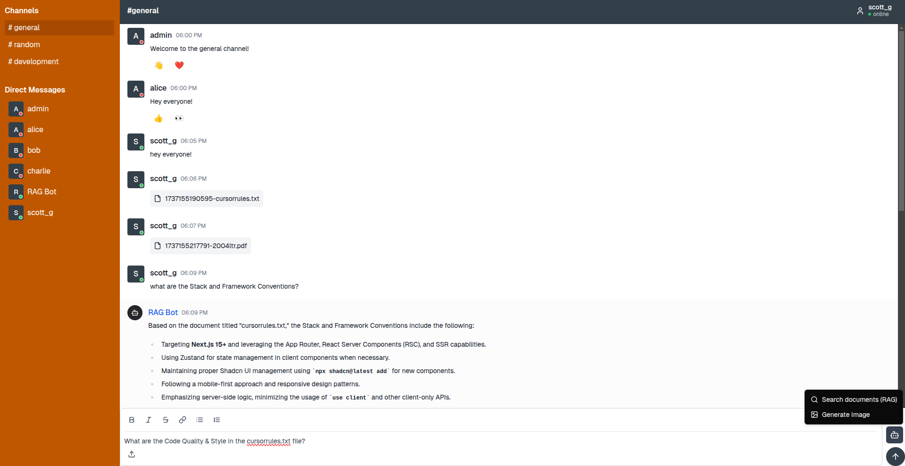
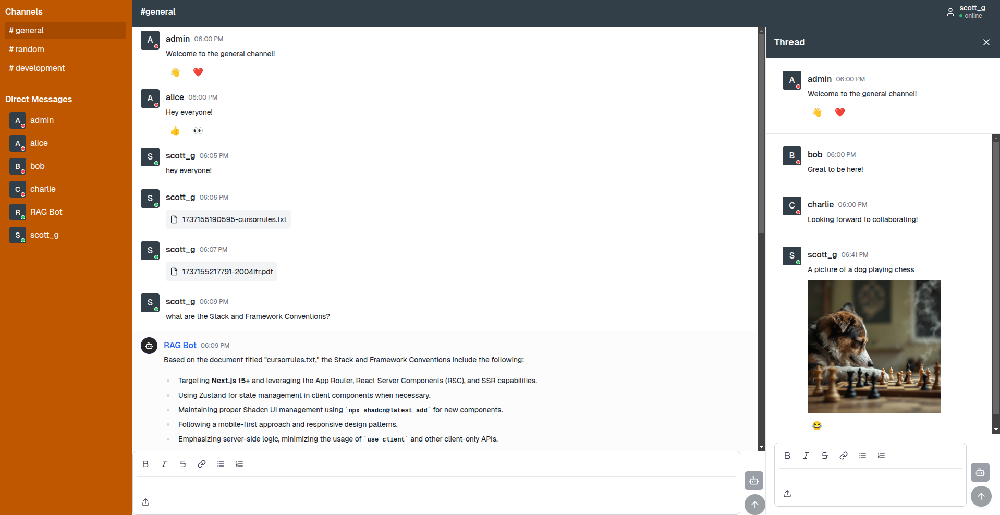

# AI enabled chat app

This app was built entirely by cursor in under two weeks. Prior to this project, I had no experience with Nextjs, React, or Supabase.

## Features

- AI enabled chat app
   - Channels
   - Direct messages
   - Thread responses
   - Emoji reactions
   - Image uploads
   - Supabase Auth
   - Supabase Storage
   - Supabase Realtime
   - Supabase Postgres
- Automated parsing of .txt and .pdf files
- RAG with Pinecone and openai
- Image generation with Replicate

## Screenshots

### Chat Interface and RAG Demo

### Thread Panel and Image Generation

